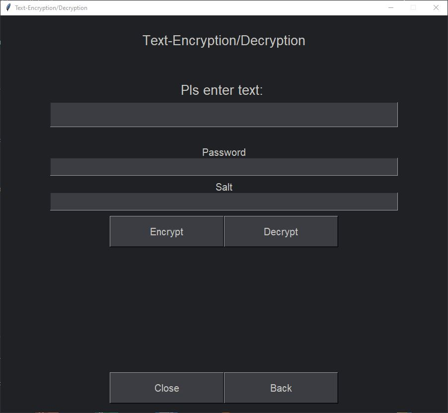
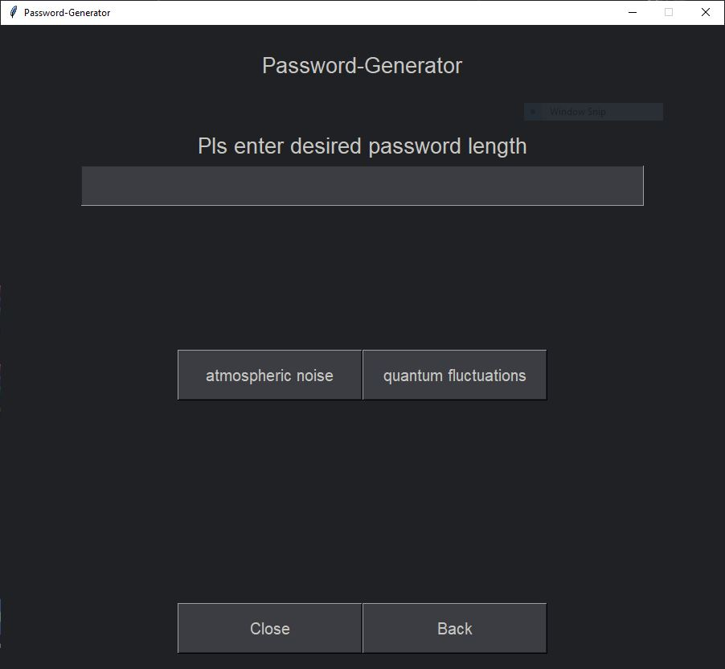
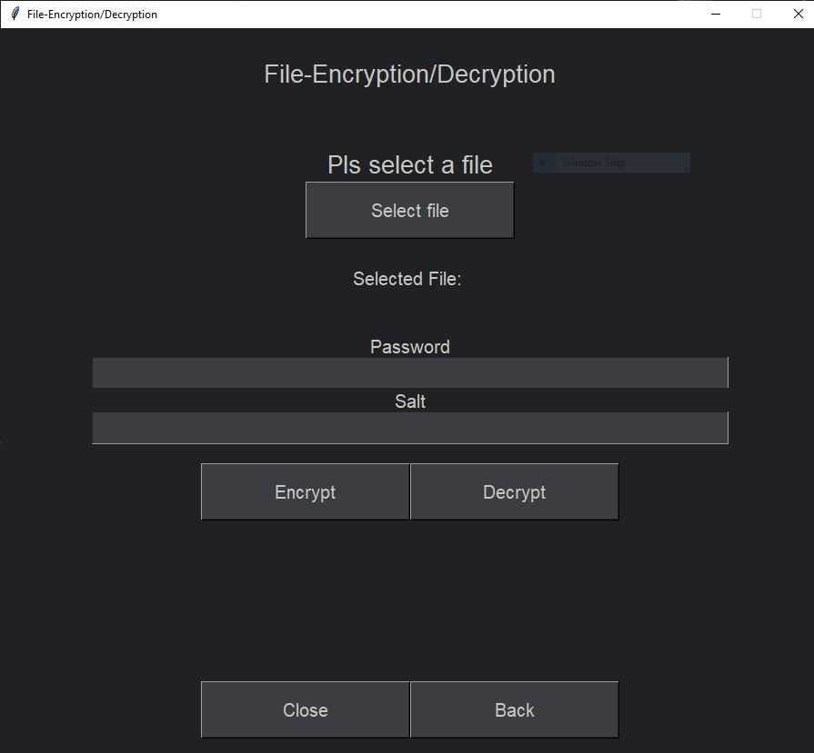
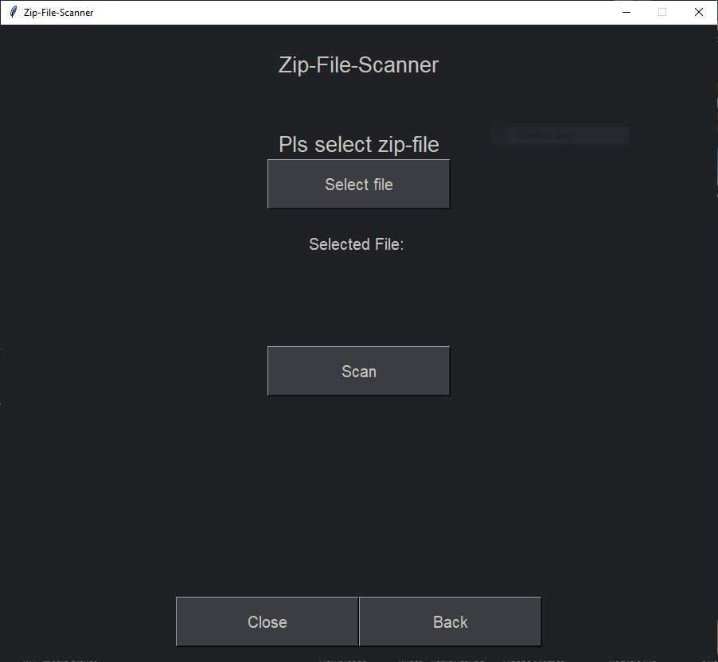

# Quantum-Tunneling-Security-Reloaded
Programm with multiple privacy and security tools

Remastered GUI based version of [Quantum-Tunneling-Security](https://github.com/Eisblume-2000/Quantum-Tunneling-Security)

## Features (as of Version 1.0)

* Text-Encryption/Decryption
* Password-Generator
* File-Encryption/Decryption
* Zip-File-Scanner
* One-Time-Decryption
* Customizable Settings

## Planned Features

* Encrypted-Local-Chat

## Text-Encryption/Decryption

* Takes a message, a password, and a salt to encrypt/decrypt the message
  
* The encrypted/decrypted message will then be displayed

## Password-Generator

* The Generator can generate passwords with any lengths
  
* The Generator uses one of two API's to request numbers and then uses these to generate a password, with the help of a character dictionary
  * All passwords will have at least one:
    * Small letter
    * Big letter
    * Number
    * Special character
  * Due to the use of API's this feature needs an Internet connection
  * The API used for quantum passwords now requires an ApiKey
    * You can set your Key in the Settings menu
    * You can get an ApiKey [here](https://quantumnumbers.anu.edu.au/) 
  
## File-Encryption/Decryption

* Takes a file, a password, and a salt to encrypt/decrypt the file
  
* The encrypted/decrypted file will be written to the specified standard output directory

## Zip-File-Scanner

* This feature takes a Zipfile and gets the size of the unpacked files
  
* It displays the size of the unpacked files as well as the ratio of size to the Zip file itself, if a certain threshold is passed it will display a warning
  * This tool is especially useful for finding Zipbombs
    * [Zipbombs, for testing purposes, can be found here](https://www.bamsoftware.com/hacks/zipbomb/)
    
 ## One-Time-Decryption
 
 * Takes a file, a password, and a salt and decrypts the file
  
 * The decrypted file will not be written to the standard output directory, but instead displayed in the program (currently only for .txt files)
 
 ## Additional features/info
 
 * Option to change the standard output directory
 * The program creates a folder at "C:\ProgramData\Quantum-Tunneling-Security-Reloaded"
 * .exe was compilled with "nuitka"
 
 ## Releases
 
 * Version 1.0 can be found [here](https://github.com/Eisblume-2000/Quantum-Tunneling-Security-Reloaded/releases/tag/v1)
 * Version 2.0 can be found [here](https://github.com/Eisblume-2000/Quantum-Tunneling-Security-Reloaded/releases/tag/v2)
 
 ## Patchnotes

 * Added ApiKey Support to Quantum passwords, thus making the module usable again
 * The program can now use your second screen if you have one
 * The config file now is a real config file
 * The settings menu was reworked and now works properly 

 
 ## TODO list
 
 * Make it so that encrypted/decrypted files keep their names
 * Add the Encrypted-Local-Chat
 * Fix bugs
 * Improve my grammar and spelling (English isn't my native language)
 * Add crashlog feature
 * Get icon for .exe file
 * Fix some close buttons not nuking the whole program
 
 ## Issues
 
 * Pls report issues [here](https://github.com/Eisblume-2000/Quantum-Tunneling-Security-Reloaded/issues)
  * Pls state how you encountered the issue
  * Pls include log files (if i add this feature)

